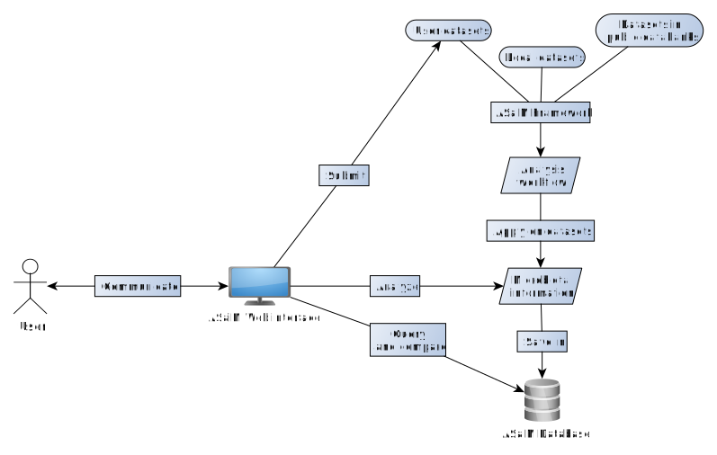

## Why ASaiM?

Massive data of intestinal microbiota are available in the public data repositories
such as [ENA](http://www.ebi.ac.uk/ena), [NCBI](http://www.ncbi.nlm.nih.gov/), 
[DDBJ](http://www.ddbj.nig.ac.jp/), ... 
For example, in ENA public data repository, 721 studies contain in their 
description the word "intestin", "gut" or "feac" and in their name "meta" 
(09/26/2015). 
However, these data are not easy to identify (many of theses 721 studies are not 
interesting), query and compare. 
Indeed the datasets underwent different analyses and the results of different
projects can not be compared directly.
The data from public data repositories need to be formated to make them
informative and standardized and then extract information such as which organisms 
are present or which functions are realized in a specific sample of gut microbiota.

For that, data from public data repositories must be re-analyzed using a full 
analytical workflow with several steps: 

1. Quality control
2. (Assembly of sequences)
3. Sort of interesting sequence
4. Functional annotation
5. Taxonomic analysis
6. Comparative analysis

Several solutions could be used: QIIME, Mothur, MEGAN, CAMERA, IMG/M, MG-RAST, 
EBI metagenomics, CloVR-metagenomics, SmashCommunity, RAMMCAP, 
MetAMOS, ... However, none of these solutions respond to all following requirements

- Complete analytical workflow with gut microbiota specific databases
- User-friendly interface and command-line use to automate analysis of numerous
datasets

## What is ASaiM exactly?

ASaiM (*Auvergne Sequence analysis of intestinal Microbiota*) is an environment 
to analyze intestinal microbiota

This environment is composed of:

- Framework to process and analyze gut microbiota data
- Database which takes an inventory of gut microbiota data from public data repositories 
and users
- Web interface to submit and query the database

To learn more on ASaiM, please read the [documentation](http://asaim.readthedocs.org/en/latest/)

## Who is involved?

The project is founded by a CPER Auvergne contract and involved multiple partners:

 * [EA 4678 - CIDAM](http://www.u-clermont1.fr/cidam.html)
 * [UR 454 - Microbio](http://www6.clermont.inra.fr/microbiologie)
 * [UMR 1213 – Unité mixte de recherche sur les herbivores (UMRH)](http://www1.clermont.inra.fr/urh/)
 * [M2iSH – UMR 1071 Inserm / UdA / USC 2018 INRA](http://www.u-clermont1.fr/m2ish.html)
 * [LIMOS – UMR CNRS 6158 / UBP / /UdA ](http://limos.isima.fr/)
 * [TailorDev](http://tailordev.fr/)
 * [CRRI](https://crri.clermont-universite.fr/)

